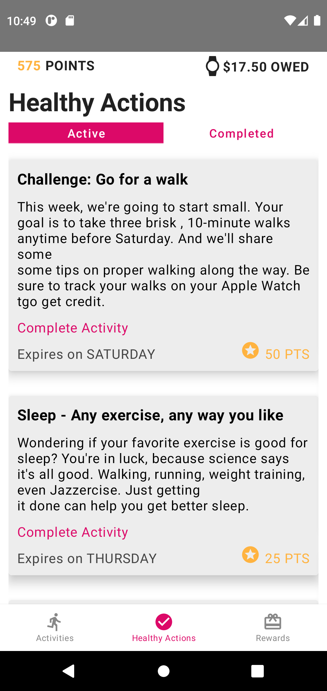

 

## "Attain" in Kotlin with MVVM and Jetpack Compose

DON'T JUDGE! THIS CODE IS UNDER HEAVY DEVELOPMENT AND NOT YET READY FOR REVIEW.

This is a clone of the **[Attain](https://www.attainbyaetna.com/)** app from Aetna/CVS. I chose to clone this app because it has an especially beautiful design
and so presented an opportunity to demonstrate the capabilities of Jetpack Compose. In addition to the visual design, it also
utilizes a single activity architecture with two types of Jetpack Compose navigation.

In this repo you'll find: 
* A single activity architecture using **[Jetpack Compose](https://developer.android.com/jetpack/compose)** and **[MutableState](https://developer.android.com/reference/androidx/lifecycle/LiveData)**. 
* Bottom and tab navigation using Jetpack Compose as well as custom shapes and animation. 
* User Interface built with a **[ViewModel](https://developer.android.com/topic/libraries/architecture/viewmodel)** for each screen. 
* Dependency injection using **[Hilt](https://developer.android.com/jetpack/androidx/releases/hilt)** . 

<table>
<tr>

<td>

</td>

<td>

</td>

<td>

</td>

</tr>
</table>